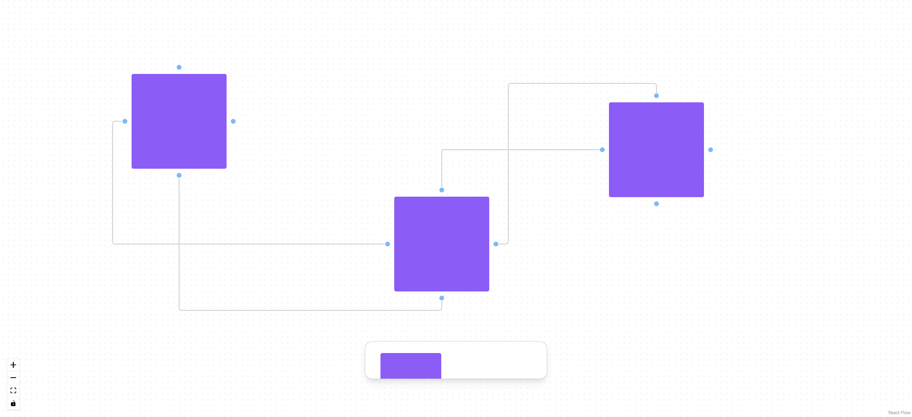

<div align="center" id="top">
  

&#xa0;

  <!-- <a href="https://uifigmajam.netlify.app">Demo</a> -->
</div>

<h1 align="center">Ui Figma Jam</h1>

<p align="center">
  

  

  

  

  <!--  -->

  <!--  -->

  <!--  -->
</p>

<!-- Status -->

<!-- <h4 align="center">
	🚧  Ui Figma Jam 🚀 Under construction...  🚧
</h4> -->

<hr>

<p align="center">
  <a href="#dart-about">About</a> &#xa0; | &#xa0;
  <a href="#sparkles-features">Features</a> &#xa0; | &#xa0;
  <a href="#rocket-technologies">Technologies</a> &#xa0; | &#xa0;
  <a href="#white_check_mark-requirements">Requirements</a> &#xa0; | &#xa0;
  <a href="#checkered_flag-starting">Starting</a> &#xa0; | &#xa0;
  <a href="#memo-license">License</a> &#xa0; | &#xa0;
  <a href="https://github.com/AlexMarquesAlves" target="_blank">Author</a>
</p>

<br>

## :dart: About

MPV de um whiteboard, um layout para anotações de ideias, baseado no Figma Jam.

## :sparkles: Features

:heavy_check_mark: reactflow ;\
:heavy_check_mark: radix-ui/react-toolbar ;\
:heavy_check_mark: reactflow/node-resizer ;\

<!-- :heavy_check_mark: Feature 3; -->

## :rocket: Technologies

The following tools were used in this project:

- [Radix UI](https://www.radix-ui.com/)
- [React](https://pt-br.reactjs.org/)
- [ReactFlow](https://reactflow.dev/)
- [TypeScript](https://www.typescriptlang.org/)

## :white_check_mark: Requirements

Before starting :checkered_flag:, you need to have [Git](https://git-scm.com)
and [Node](https://nodejs.org/en/) installed.

## :checkered_flag: Starting

```bash
# Clone this project
$ git clone https://github.com/AlexMarquesAlves/ui-figma-jam

# Access
$ cd ui-figma-jam

# Install dependencies
$ yarn

# Run the project
$ yarn start

# The server will initialize in the <http://localhost:3000>
```

## :memo: License

This project is under license from MIT. For more details, see the
[LICENSE](LICENSE.md) file.

Made with :heart: by
<a href="https://github.com/AlexMarquesAlves" target="_blank">¡Duque</a>

&#xa0;

<a href="#top">Back to top</a>
